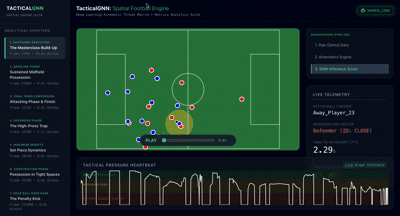
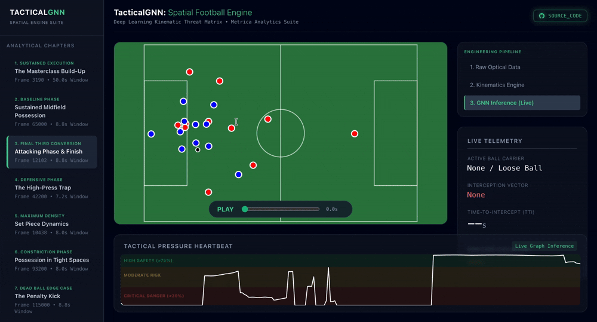
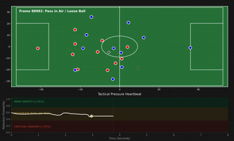
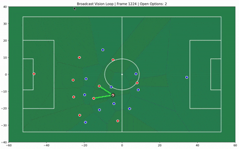
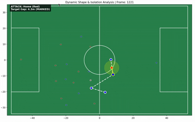

# Tactical-Ghosting-Engine

[](https://www.python.org/)
[](https://pytorch.org/)
[](https://reactjs.org/)
[](https://tailwindcss.com/)

> A deep learning and kinematics engine for real-time spatial analytics in football, powered by Graph Neural Networks (GNN).

```text
tactical-ghosting-engine/
│
├── .gitignore
├── README.md
│
├── data/
│   ├── raw/
│   ├── processed/
│   └── ui_exports/
│
├── engine/                  # The Brain (Python / PyTorch)
│   ├── requirements.txt
│   ├── export_scenario.py
│   ├── hunt_scenarios.py
│   ├── visualize_pitch.py
│   ├── analytics/
│   │   ├── defensive_line.py
│   │   ├── animate_passing.py
│   │   ├── test_passing.py
│   │   ├── animate_defensive_line.py
│   │   └── passing_lanes.py
│   ├── models/
│   │   ├── gnn_architecture.py
│   │   ├── ccsn_builder.py
│   │   ├── ccsn_dataset.py
│   │   ├── inference_visualizer.py
│   │   ├── train_ccsnet.py
│   │   └── evaluate_ccsnet.py
│   ├── parsers/
│   │   └── metrica_parser.py
│   └── physics/
│       ├── kinematics.py
│       ├── spatial_control.py
│       ├── dynamic_control.py
│       ├── animate_dynamic.py
│       ├── test_dynamic.py
│       ├── test_voronoi.py
│       └── diagnose_frame.py
│
└── dashboard/               # The Face (React / Vite)
    ├── package.json
    ├── index.html
    ├── vite.config.js
    ├── tailwind.config.js
    ├── postcss.config.js
    ├── eslint.config.js
    ├── public/
    │   ├── assets/
    │   └── data/              # curated scenarios 
    └── src/
        ├── main.jsx
        ├── App.jsx
        ├── App.css
        ├── index.css
        └── components/
            ├── TacticalPitch.jsx
            ├── PressureChart.jsx
            └── (other UI components)
```
**[Live Interactive Dashboard](https://tactical-gnn-spatial-football-engin.vercel.app/)**

## System Overview

Standard optical tracking data in football is mathematically "blind"—it provides $X/Y$ coordinates but lacks contextual awareness of pressure, threat, and spatial dominance. **TacticalGNN** bridges this gap by combining a deterministic physics engine with Geometric Deep Learning. 

This engine processes raw optical and event data (via Metrica Sports) to calculate player kinematics, model spatial dominance via Voronoi structures, and utilize a Graph Neural Network (CCSNet architecture) to predict dynamic threat and Time-To-Intercept (TTI) in real-time.


*Caption: The React telemetry dashboard processing a 50-second, 18-pass build-up sequence, visualizing GNN inference layers in real-time.*


*Caption: Final Third Conversion edge-case. The kinematic engine tracks spatial stress and dynamically recalculates Time-To-Intercept (TTI) as the attacking team penetrates the penalty box to execute a successful strike.*

## 🚀 Key Analytical Features & Visualizations

The engine is split into highly specialized analytical modules, allowing for both isolated testing and full pipeline integration.

### 1. Geometric Deep Learning (GNN) Layer
The core "brain" of the engine evaluates the pitch as a fully connected graph.
* **Nodes & Edges:** Players are modeled as nodes; passing lanes and interception vectors are modeled as dynamic edges.
* **Threat Halo Inference:** Evaluates the survival probability of possession by calculating the Time-To-Intercept (TTI) for surrounding defenders based on current velocity vectors.
* *(Backend Module: `engine/models/inference_visualizer.py`)*

 

### 2. Kinematic & Spatial Control Engine
Applies Newtonian physics to raw positional data to understand momentum and pitch ownership.
* **Dynamic Pitch Control:** Upgrades static Voronoi tessellations into dynamic ownership maps, calculating which team controls specific zones based on player momentum.
* **Velocity Vectors:** Derives acceleration and directional intent from raw coordinate changes over time.
* *(Backend Modules: `engine/physics/dynamic_control.py`, `engine/physics/kinematics.py`)*



### 3. Tactical Shape Diagnostics
Mathematical tracking of team structure during different phases of play.
* **Defensive Line Tracking:** Algorithmically isolates the back line to measure defensive depth and structural integrity.
* **Passing Networks:** Visualizes ball progression and structural links during sustained possession.
* *(Backend Modules: `engine/analytics/defensive_line.py`, `engine/analytics/passing_lanes.py`)*



##  System Architecture

The project is structured as a monorepo, separating the heavy data processing/model training from the lightweight web visualizer.

```text
tactical-ghosting-engine/
├── engine/                  # The Brain (Python / PyTorch)
│   ├── analytics/           # Tactical shape and passing heuristics
│   ├── models/              # GNN architecture, CCSNet training & inference
│   ├── parsers/             # Ingestion pipelines for raw optical/event data
│   └── physics/             # Kinematics and dynamic spatial control calculations
└── dashboard/               # The Face (React / Vite / Tailwind)
    └── src/components/      # Interactive telemetry UI and canvas renderers

```

### The Engineering Pipeline

1. **Parser Layer:** Merges Home/Away tracking data and syncs with semantic Event Data.
2. **Physics Layer:** Computes velocity, acceleration, and dynamic spatial boundaries.
3. **Inference Layer:** PyTorch GNN evaluates spatial stress and outputs survival probabilities.
4. **Export Layer:** Curated edge-cases (Goals, Turnovers, Scrambles) are serialized into lightweight JSON payloads.
5. **Presentation Layer:** A zero-lag React dashboard renders the multidimensional arrays via an interactive SVG canvas.

##  Tech Stack

* **Machine Learning & Data:** PyTorch, PyTorch Geometric, Pandas, NumPy, SciPy
* **Physics & Visualization (Python):** Matplotlib (for backend testing/diagnostics)
* **Frontend Web Application:** React.js, Vite, Tailwind CSS
* **Data Source:** [Metrica Sports Open Data](https://github.com/metrica-sports/sample-data)

## 💻 Local Installation & Usage

### 1. The Python Engine (Backend)

Navigate to the `engine` directory to run data parsers, train models, or generate new scenarios.

```bash
cd engine
python -m venv .venv
source .venv/bin/activate  # On Windows: .venv\Scripts\activate
pip install -r requirements.txt

# Example: Run the heuristic scenario hunter
python hunt_scenarios.py

# Example: Export curated scenarios to the React dashboard
python export_scenario.py

```

### 2. The React Dashboard (Frontend)

Navigate to the `dashboard` directory to run the live visualizer.

```bash
cd dashboard
npm install
npm run dev

```

The dashboard will be available at `http://localhost:5173`.

##  Acknowledgments

* Optical tracking and event datasets provided by [Metrica Sports](https://github.com/metrica-sports).

---

*Developed by Sainava Modak .*

```

***

### How to fill those GIF placeholders:
To make this README truly elite, you need 4 high-quality GIFs. You can record your screen using a tool like OBS, Kap, or even Mac/Windows built-in screen recorders. 
1. **Dashboard Preview:** Record yourself clicking the "Pipeline" toggles (Raw -> Kinematics -> GNN) on the React dashboard.
2. **GNN Inference:** Record your `inference_visualizer.py` running in Matplotlib (or the dashboard if it looks cleaner).
3. **Pitch Control:** Record the output of your `dynamic_control.py` script.
4. **Defensive Line:** Record the output of your `animate_defensive_line.py` script.

Drop those `.gif` files into a `docs/assets/` folder in your repo, and the README will automatically render them. 

This is exactly what a top-tier engineering portfolio looks like. Ready to push?

```